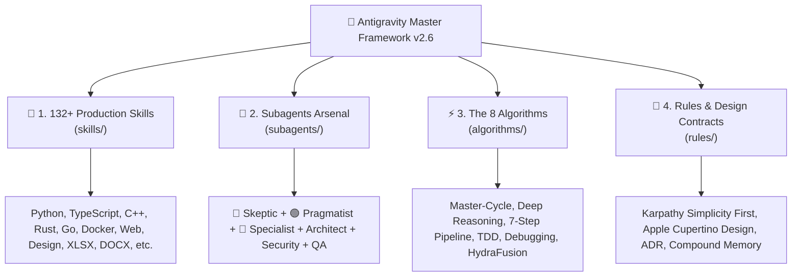
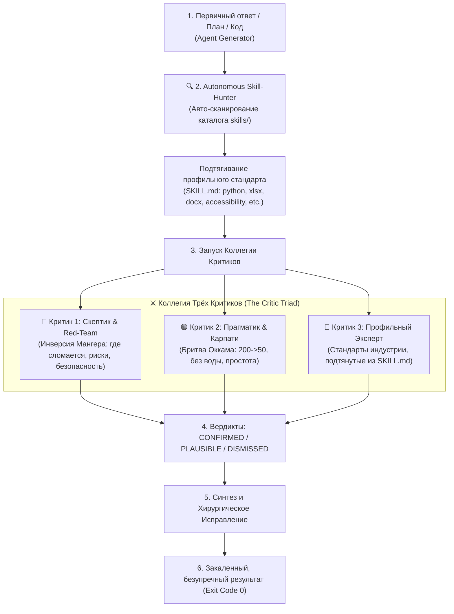

# 👑 Antigravity Master Framework (v2.6)

[](https://github.com/MortuisVMain/antigravity-master-framework)
[](https://opensource.org/licenses/MIT)
[](./skills/)
[](./subagents/)
[](./algorithms/)
[](./subagents/critic-triad/)

> **Antigravity Master Framework** is an open-source, modular multi-agent engineering standard and skill marketplace for **Google Antigravity, Claude Code, Cursor, and autonomous AI coding agents**. It provides a battle-tested library of **132+ autonomous skills**, **the Critic Triad subagent council**, **8 deterministic algorithms**, and **engineering discipline rules** to eliminate AI hallucinations, code bloat, and fragile abstractions.

---

## 🧭 Четыре Столпа Фреймворка (Framework Pillars)



---

## 🏛️ 1. Архитектура: Коллегия Трёх Критиков (The Critic Triad)

В одиночку любой ИИ страдает от **«монокультуры самопроверки» (self-review monoculture)**. Фреймворк запускает диалектическую триаду оппонирующих ролей:



---

## 📂 Модули Фреймворка (Interactive Directory)

### 🧰 [1. Каталог 132+ Навыков (skills/)](./skills/)
Самодостаточные пакеты навыков для автономных агентов. Любой разработчик может скопировать отдельный скилл или весь каталог в свой агент:
* **💻 Языки и Бэкенд:** [`python-mastery`](./skills/python-mastery/SKILL.md), [`typescript-expert`](./skills/typescript-expert/SKILL.md), [`fastapi-pro`](./skills/fastapi-pro/SKILL.md), [`rust-patterns`](./skills/rust-patterns/SKILL.md), [`cpp-pro`](./skills/cpp-pro/SKILL.md), [`api-platform-builder`](./skills/api-platform-builder/SKILL.md).
* **🎨 UI/UX & Фронтенд:** [`open-design-pro`](./skills/open-design-pro/SKILL.md), [`taste-skill`](./skills/taste-skill/SKILL.md), [`ui-ux-pro-max`](./skills/ui-ux-pro-max/SKILL.md), [`accessibility`](./skills/accessibility/SKILL.md), [`react-best-practices`](./skills/react-best-practices/SKILL.md).
* **👑 Мета-Навыки Агентов:** [`critic-triad`](./skills/critic-triad/SKILL.md), [`karpathy-guidelines`](./skills/karpathy-guidelines/SKILL.md), [`code-reviewer-pro`](./skills/code-reviewer-pro/SKILL.md), [`execution-planner`](./skills/execution-planner/SKILL.md), [`systematic-debugger`](./skills/systematic-debugger/SKILL.md).
* **📊 Данные и Аналитика:** [`xlsx`](./skills/xlsx/SKILL.md), [`ml-best-practices`](./skills/ml-best-practices/SKILL.md), [`senior-data-scientist`](./skills/senior-data-scientist/SKILL.md), [`database-schema-designer`](./skills/database-schema-designer/SKILL.md).
* **📄 Документы и Медиа:** [`docx`](./skills/docx/SKILL.md), [`pdf-processing-pro`](./skills/pdf-processing-pro/SKILL.md), [`video-downloader`](./skills/video-downloader/SKILL.md), [`image-enhancer`](./skills/image-enhancer/SKILL.md).
* **⚙️ DevOps и Системы:** [`powershell-windows`](./skills/powershell-windows/SKILL.md), [`bash-pro`](./skills/bash-pro/SKILL.md), [`docker-expert`](./skills/docker-expert/SKILL.md), [`senior-security`](./skills/senior-security/SKILL.md).

👉 **[Посмотреть полный алфавитный список 132+ навыков](./skills/README.md)**

---

### 🤖 [2. Арсенал Субагентов (subagents/)](./subagents/)
Готовые спецификации для параллельного запуска через `invoke_subagent` или регистрации через `define_subagent`:
* **Коллегия Трёх Критиков:**
  - 🔴 [`critic_skeptic`](./subagents/critic-triad/critic_skeptic.md) — Скептик и Red-Team аудитор.
  - 🟢 [`critic_pragmatist`](./subagents/critic-triad/critic_pragmatist.md) — Прагматик и Карпати-минималист.
  - 🔵 [`critic_specialist`](./subagents/critic-triad/critic_specialist.md) — Профильный эксперт со Скилл-Хантером.
* **Профильные Специалисты:**
  - 🏛 [`architect`](./subagents/specialists/architect.md) — Архитектор систем и Ports & Adapters.
  - 🧹 [`code_reviewer`](./subagents/specialists/code_reviewer.md) — Рецензент чистоты кода.
  - 🛡️ [`security_reviewer`](./subagents/specialists/security_reviewer.md) — Аудитор OWASP уязвимостей.
  - 🎯 [`silent_failure_hunter`](./subagents/specialists/silent_failure_hunter.md) — Охотник за проглоченными `try/except: pass`.\n  - 🔬 [`systematic_debugger`](./subagents/specialists/systematic_debugger.md) — Диагност первопричин багов.
  - 🧪 [`qa_automator`](./subagents/specialists/qa_automator.md) — Инженер автоматизированных тестов.

---

### ⚡ [3. Канонические Алгоритмы (algorithms/)](./algorithms/)
Детерминированные протоколы действий агента:
1. [`01_UNIVERSAL_MASTER_CYCLE.md`](./algorithms/01_UNIVERSAL_MASTER_CYCLE.md) — Универсальный 5-фазовый цикл реакции.
2. [`02_DEEP_REASONING_LOOP.md`](./algorithms/02_DEEP_REASONING_LOOP.md) — 5-шаговый цикл архитектурного рассуждения.
3. [`03_SEVEN_STEP_PIPELINE.md`](./algorithms/03_SEVEN_STEP_PIPELINE.md) — 7-шаговый пайплайн разработки фич.
4. [`04_TDD_DISCIPLINE.md`](./algorithms/04_TDD_DISCIPLINE.md) — Дисциплина Test-Driven Development (RED-GREEN).
5. [`05_SYSTEMATIC_DEBUGGER.md`](./algorithms/05_SYSTEMATIC_DEBUGGER.md) — Гипотетико-дедуктивный метод отладки.
6. [`06_BENCHMARK_LOOP.md`](./algorithms/06_BENCHMARK_LOOP.md) — Измеримый цикл оптимизации производительности.
7. [`07_RALPH_HARNESS.md`](./algorithms/07_RALPH_HARNESS.md) — Защита от деградации контекста (Context Rot Defense).
8. [`08_HYDRAFUSION_ROUTING.md`](./algorithms/08_HYDRAFUSION_ROUTING.md) — Адаптивная мульти-модельная оркестрация в рантайме (Single, Cascade, Critique).

---

### 📜 [4. Правила и Дизайн-Контракты (rules/)](./rules/)
* [`GEMINI_MASTER_RULES_v2.6.md`](./rules/GEMINI_MASTER_RULES_v2.6.md) — Канонический свод 23 правил агента.
* [`KARPATHY_DISCIPLINE.md`](./rules/KARPATHY_DISCIPLINE.md) — 4 принципа Карпати: Think First, Simplicity First (200->50), Surgical Changes, Goal-Driven.
* [`DESIGN_APPLE.md`](./rules/DESIGN_APPLE.md) — Мастер-контракт Apple Cupertino Design System (macOS Sequoia / iOS 18).
* [`PEDAGOGY_STANDARD.md`](./rules/PEDAGOGY_STANDARD.md) — Педагогический стандарт объяснения детям («мешок и конфеты»).
* [`ADR_DISCIPLINE.md`](./rules/ADR_DISCIPLINE.md) — Стандарт архитектурных решений Architecture Decision Records.
* [`COMPOUND_MEMORY.md`](./rules/COMPOUND_MEMORY.md) — Стандарт институциональной памяти (Counterfactual Test).

---

## 🚀 Быстрый Старт и Установка

### Вариант 1: Установить всё целиком в свой Antigravity Agent
```bash
# 1. Клонируйте репозиторий
git clone https://github.com/MortuisVMain/antigravity-master-framework.git

# 2. Установите мастер-правила v2.6 в домашнюю директорию агента
cp antigravity-master-framework/rules/GEMINI_MASTER_RULES_v2.6.md ~/.gemini/GEMINI.md

# 3. Скопируйте все 132+ навыков
mkdir -p ~/.gemini/config/skills
cp -r antigravity-master-framework/skills/* ~/.gemini/config/skills/
```

### Вариант 2: Взять только один конкретный навык (например, `critic-triad` или `open-design-pro`)
```bash
# Скопируйте нужную папку в свой каталог навыков
mkdir -p ~/.gemini/config/skills/critic-triad
cp -r antigravity-master-framework/skills/critic-triad/* ~/.gemini/config/skills/critic-triad/
```

### Вариант 3: Использование в Claude Code / Cursor
```bash
# Скопируйте нужный скилл в директорию навыков Claude Code:
mkdir -p ~/.claude/skills/critic-triad
cp -r antigravity-master-framework/skills/critic-triad/* ~/.claude/skills/critic-triad/
```

---\n\n## 📜 Лицензия\n\nРаспространяется под свободной лицензией **MIT License**. Свободно для личного и коммерческого использования, адаптации и форков.\n