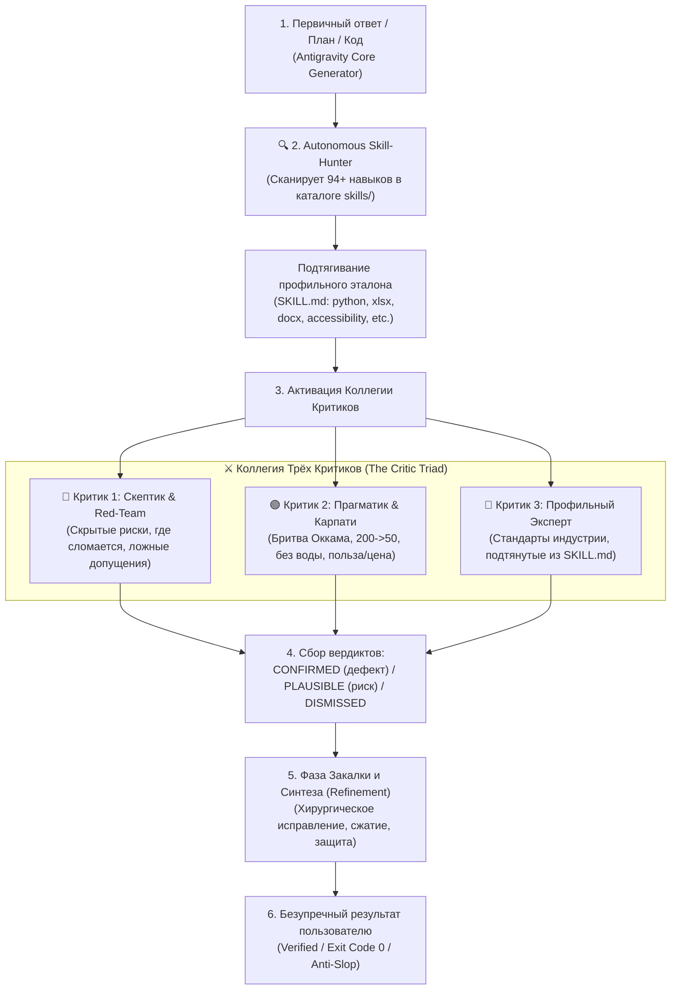
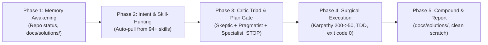

# 👑 Antigravity Agent Framework (v2.6)

[](https://github.com/MortuisVMain/antigravity-master-framework)
[](https://opensource.org/licenses/MIT)
[](https://github.com/MortuisVMain/antigravity-master-framework)
[](./skills/)
[](./PROJECTS_TEST_MATRIX.md)

> **Antigravity Agent Framework v2.6** is an elite, open-source multi-agent engineering standard designed for Google Antigravity, Claude Code, and autonomous AI coding agents. It eradicates AI hallucination, blind spots, and code-bloat through the **Critic Triad & Autonomous Skill-Hunter**, enforced **Karpathy Simplicity First**, and **Apple Cupertino Design Contracts**.

---

## 📑 Оглавление

1. [Архитектура «Триумвират Критиков» (The Critic Triad)](#-1-архитектура-триумвират-критиков-the-critic-triad)
2. [Канонический Мастер-Цикл Реакции (v2.6)](#-2-канонический-мастер-цикл-реакции-v26)
3. [8 Универсальных Доменов & Автономный Скилл-Хантер](#-3-8-универсальных-доменов--автономный-скилл-хантер)
4. [4 Принципа Андрея Карпати (Karpathy Discipline)](#-4-4-принципа-андрея-карпати-karpathy-discipline)
5. [Мастер-Контракт Дизайна Apple Cupertino (macOS Sequoia / iOS 18)](#-5-мастер-контракт-дизайна-apple-cupertino)
6. [Сводная Матрица Тестирования Проектов Студии](#-6-сводная-матрица-тестирования-проектов-студии)
7. [Быстрый Старт и Установка](#-7-быстрый-старт-и-установка)
8. [Структура Репозитория](#-8-структура-репозитория)

---

## 🏛️ 1. Архитектура «Триумвират Критиков» (The Critic Triad)

Одиночный ИИ страдает от **«монокультуры самопроверки» (self-review monoculture)** — он не замечает собственных систематических допущений и слепых зон. **Коллегия Трёх Критиков** создает диалектическое напряжение:



### Персоны Критиков:
* **🔴 Критик 1 (Скептик / Red-Team / Failure Hunter):** Инверсия Мангера (*«Скажи мне, где я сломаюсь, чтобы я туда не ходил»*). Ищет гонки потоков, утечки памяти, дедлоки, падения на путях Windows, проглоченные `except: pass` и скрытые расходы.
* **🟢 Критик 2 (Прагматик / Карпати / Бритва Оккама):** *«Можно ли 200 строк переписать в 50?»*. Уничтожает шаблонный AI-шлак (slop), вырезает ненужные фабрики и зависимости, требует нулевых побочных правок (zero collateral edits).
* **🔵 Критик 3 (Профильный Эксперт / Skill-Hunter):** Автоматически находит нужный навык в библиотеке (94+ скиллов), читает его спецификацию и инспектирует код на соответствие высшим отраслевым эталонам (Pydantic V2, OKLCH, WCAG, и т.д.).

---

## ⚡ 2. Канонический Мастер-Цикл Реакции (v2.6)

На **любой** входящий запрос пользователя агент выполняет строгий детерминированный цикл из 5 фаз:



1. **Phase 1 — Пробуждение Памяти:** Контекст репозитория, активные супер-скиллы, база решений (`docs/solutions/`).
2. **Phase 2 — Классификация & Скилл-Хантинг:** Определение домена и автоматическое подтягивание профильных инструкций.
3. **Phase 3 — Аудит Тройки Критиков & План-Шлюз:** Построение визуального плана в Mermaid. **СТОП до явного одобрения пользователем.**
4. **Phase 4 — Хирургическое Исполнение:** TDD RED ➔ GREEN, сжатие кода, обязательная проверка `exit code 0` в консоли перед докладом о готовности.
5. **Phase 5 — Фиксация Памяти & Отчёт:** Запись неочевидных выводов в `docs/solutions/` по тесту контрфактуальности.

---

## 🌐 3. 8 Универсальных Доменов & Автономный Скилл-Хантер

| # | Домен | Авто-подтягиваемые Скиллы | Фокус Аудита |
| :-: | :--- | :--- | :--- |
| **1** | **💻 Код, Багфикс & Архитектура** | `python-mastery`, `code-reviewer-pro`, `karpathy-guidelines`, `systematic-debugger` | Чистая архитектура, zero-leak, TDD, строгая типизация, exit code 0. |
| **2** | **🎨 UI/UX & Фронтенд** | `open-design-pro`, `taste-skill`, `accessibility`, `web-design-guidelines` | Контракт Apple/Vercel, OKLCH палитра, зоны ≥48px, пружинная физика. |
| **3** | **💡 Идеи, Бизнес & Продукты** | `ce-ideate`, `ce-strategy`, `personal-tool-builder` | Реальный спрос, защита от копирования (moat), запуск MVP за 24 часа. |
| **4** | **☕ Повседневные вопросы & Быт** | `accidental-data-loss-prevention`, `clean-code` (бытовая логика) | Защита от переплат, скрытые комиссии, надежность, соотношение цена/качество. |
| **5** | **🎓 Обучение & Педагогика** | *Школьный стандарт 10 лет, 5 класс* | Модель «мешок и конфеты», сюжетные задачи в 2-3 действия, anti-cheating UI. |
| **6** | **📊 Данные, Таблицы & Финансы** | `xlsx`, `ml-best-practices`, `senior-data-scientist` | Формулы без `#VALUE!`, строгие типы, сценарии чувствительности. |
| **7** | **📄 Документы & Тексты** | `docx`, `pdf-processing-pro` | Читабельность, полиграфический стандарт A4, однозначность формулировок. |
| **8** | **⚙️ DevOps, Системы & Скрипты** | `powershell-windows`, `bash-pro`, `docker-expert` | Безопасность путей Windows, отсутствие деструктивных команд без спроса. |

---

## 🛡️ 4. 4 Принципа Андрея Карпати (Karpathy Discipline)

1. **Think Before Coding:** Никогда не делать молчаливых предположений. Озвучивать компромиссы. Пресекать оверинжиниринг.
2. **Simplicity First:** Минимальный код, решающий задачу. Никаких спекулятивных абстракций. *Senior Engineer Test:* «Если 200 строк можно переписать в 50 — перепиши в 50».
3. **Surgical Changes:** Трогать только то, что запрошено. Никаких побочных правок чужих файлов, стилей или комментариев.
4. **Goal-Driven Execution:** Каждая задача формулируется как объективный критерий верификации в консоли до получения `exit code 0`.

---

## 🍏 5. Мастер-Контракт Дизайна Apple Cupertino

Все визуальные интерфейсы подчиняются единому эстетическому коду **macOS Sequoia / iOS 18**:
* **Матовое стекло (Frosted Glass):** `backdrop-filter: blur(24px) saturate(180%)`.
* **Поверхность Space Black:** Базовая подложка `#000000`, карточки `rgba(26, 26, 30, 0.72)`.
* **Субпиксельный Кант (Hairline Border):** `1px solid rgba(255, 255, 255, 0.12)`.
* **Типографика SF Pro:** Плотный кернинг `letter-spacing: -0.025em`, моноширинные цифры `tnum` для таймеров.
* **Пружинная Физика (Spring Physics):** `cubic-bezier(0.25, 1, 0.5, 1)`.

---

## 📊 6. Сводная Матрица Тестирования Проектов Студии

Полный реестр 6 софтверных проектов студии, модернизированных по стандарту v2.6, вынесен в отдельный документ:  
👉 **[Открыть Полную Матрицу Тестирования (PROJECTS_TEST_MATRIX.md)](./PROJECTS_TEST_MATRIX.md)**

| Проект | Стек | Что Сделано | Статус |
| :--- | :--- | :--- | :---: |
| **Cashflow Hub & Shorts Factory** | Python, Edge-TTS, MoviePy, SQLite | Фабрика Shorts про финансы, Apple-караоке субтитры, фикс falsy-фолбэка | ✅ 16/16 PASS (0) |
| **ScreenDimmer Pro** | C# .NET 10, Win32 DDC/CI, WMI | macOS Sequoia Dynamic Island HUD пилюля (240x64px), аппаратная яркость | ✅ Release 0 errors (0) |
| **Open Steam Idler** | Electron 33, React 18, Vite, Tailwind | Фарм карточек Steam, тема Space Black, матовый сайдбар, SF Pro tnum | ✅ tsc clean (0) |
| **Power Management Suite** | Python 3, Tkinter, Win32 API, PyInstaller | macOS Control Center виджет таймера `ApplePowerSuite.py` + стимпанк GUI | ✅ Байткод чист (0) |
| **Wallpaper Turbo Downloader** | Userscript, Canvas, dHash, JSZip | Пакетный сборщик обоев с GoodFon/Wallhaven, Dynamic Island Dock | ✅ JS clean (0) |
| **Video Turbo Downloader** | Userscript, HTML5 Video, Aria2 RPC | Перехват защищенных видео (SxyPrn), Control Center пилюля, Aria2/Curl | ✅ JS clean (0) |
| **Critic Triad Engine** | Multi-Agent Triad, 94+ Skills Catalog | Тройка критиков со Скилл-Хантером, защита от амнезии и AI-slop | ✅ Урок 011 зафиксирован |

---

## 🚀 7. Быстрый Старт и Установка

### Для Antigravity IDE / CLI (`agy`):
```bash
# Клонируйте репозиторий правил и навыков
git clone https://github.com/MortuisVMain/antigravity-master-framework.git

# Скопируйте глобальные правила в домашнюю директорию агента
cp antigravity-master-framework/rules/GEMINI_MASTER_RULES_v2.6.md ~/.gemini/GEMINI.md

# Установите супер-скилл Тройки Критиков
mkdir -p ~/.gemini/config/skills/critic-triad
cp antigravity-master-framework/skills/critic-triad/SKILL.md ~/.gemini/config/skills/critic-triad/
```

---

## 📁 8. Структура Репозитория

```
antigravity-master-framework/
├── README.md                          # Главный манифест фреймворка
├── PROJECTS_TEST_MATRIX.md            # Детальная матрица проверенных проектов
├── LICENSE                            # Лицензия MIT
├── rules/
│   ├── GEMINI_MASTER_RULES_v2.6.md    # Канонические мастер-правила v2.6
│   └── DESIGN_APPLE.md                # Мастер-контракт Apple Cupertino Design
├── skills/
│   └── critic-triad/
│       └── SKILL.md                   # Спецификация супер-скилла Тройки Критиков
└── docs/
    └── SOLUTIONS_LEARNINGS.md         # Реестр институциональной памяти (уроки 001-011)
```

---

## 📜 Лицензия
Проект распространяется под свободной лицензией **MIT License**. Разработано для студии **MortuisVMain Production Hub**.
