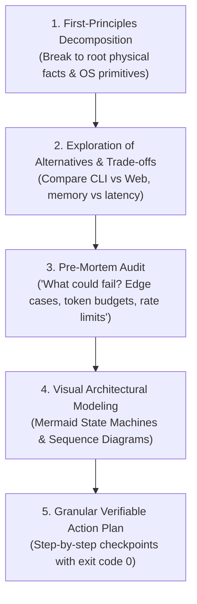

# 🧠 02. Extended Thinking & 5-Step Deep Reasoning Loop

For all non-trivial features, refactorings, and architectures, execute this rigorous 5-step analysis before touching production code:

### Checkpoints:
1. **First-Principles:** What are the physical and protocol constraints? (Network sockets, file locks, OS handles).
2. **Trade-offs:** Why approach A over approach B? Document memory, speed, and DX implications.
3. **Pre-Mortem:** Inversion thinking — how will this break in 6 months?
4. **Visual Modeling:** Every async or multi-component flow MUST be drawn in Mermaid.
5. **Granular Action Plan:** Every single task must map to a command returning `exit code 0`.
