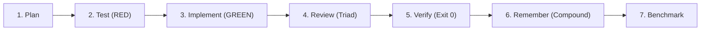

# ⚙️ 03. 7-Step Feature Development Pipeline

For every software feature, module, or game mechanic:

1. **Plan:** Architecture modeling, diff list, user gate approval.
2. **Test (RED):** Write failing unit/integration tests confirming the gap.
3. **Implement (GREEN):** Minimal surgical code satisfying the tests (Karpathy simplicity).
4. **Review (Triad):** Multi-agent pass (Clean code, Security OWASP, Silent failure hunting).
5. **Verify:** Execute terminal commands, check logs, ensure `exit code 0`.
6. **Remember:** Record counterfactual lessons in `docs/solutions/`.
7. **Benchmark:** Profile CPU/RAM/latency if performance-critical.
