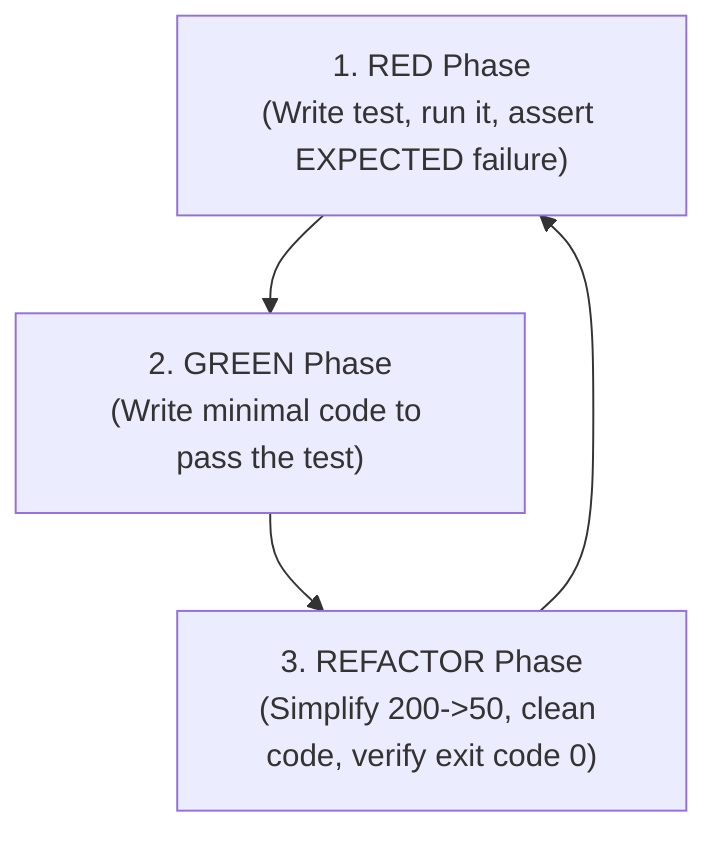

# 🧪 04. Test-Driven Development (TDD) Discipline

## The Unbreakable Law
**NO production code is written without a failing test first.**

## Core Standards:
- **80%+ Coverage Minimum** across business logic branches.
- **Never mock what you do not own.** Favor integration tests with ephemeral local servers over complex fake mocks.
- **Edge cases mandatory:** `None`, empty string `""`, negative numbers, max integer, network dropouts, rate limits.
- **Test Isolation:** Never write `api_key or os.getenv()`; always use `if api_key is not None:`.
