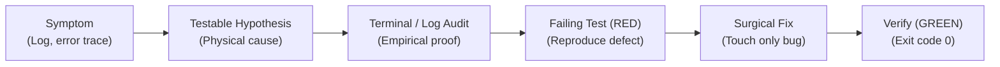

# 🔍 05. Systematic Debugger (Hypothesis-Deductive Method)

Every troubleshooting action follows the strict hypothesis-deductive chain. Shotgun fixes and random file resets are strictly banned.

## Rules of Engagement:
1. **Never guess:** Read full stack traces and contextual variable dumps before writing a single line.
2. **Reproduce first:** Create a minimal reproducible test case.
3. **Surgical remediation:** Fix root cause, do not mask symptoms with `try/except: pass`.
