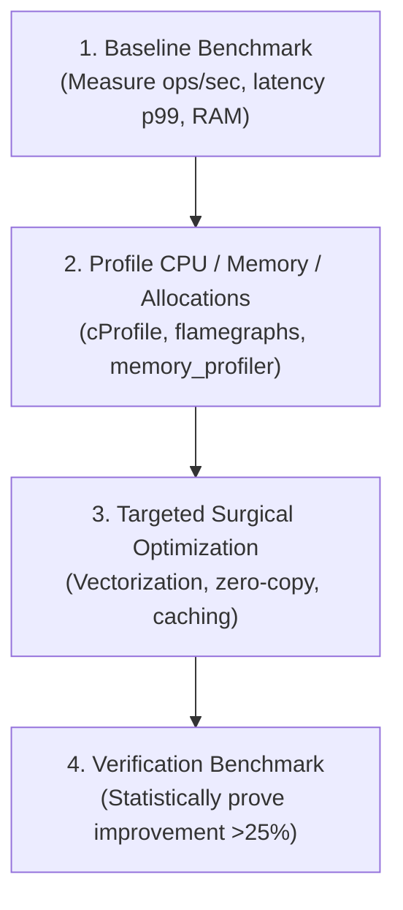

# ⏱️ 06. Benchmark-Driven Optimization Loop

Never guess where bottlenecks are. Optimization without profiling is malpractice.

Accept optimizations ONLY when empirical benchmark logs prove measurable gain.
