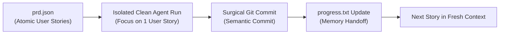

# 🔁 07. Ralph Autonomous Execution Loop (Context Rot Defense)

When tasks take longer than 15 minutes or require dozens of tool calls, single LLM contexts suffer from severe cognitive decay (context rot).

## Mechanics:
- Decompose complex workflows into atomic User Stories in `prd.json`.
- Execute each story in an isolated context window with automated tests.
- Commit to git immediately upon story completion.
- Pass memory forward via `progress.txt` and `docs/solutions/`.
