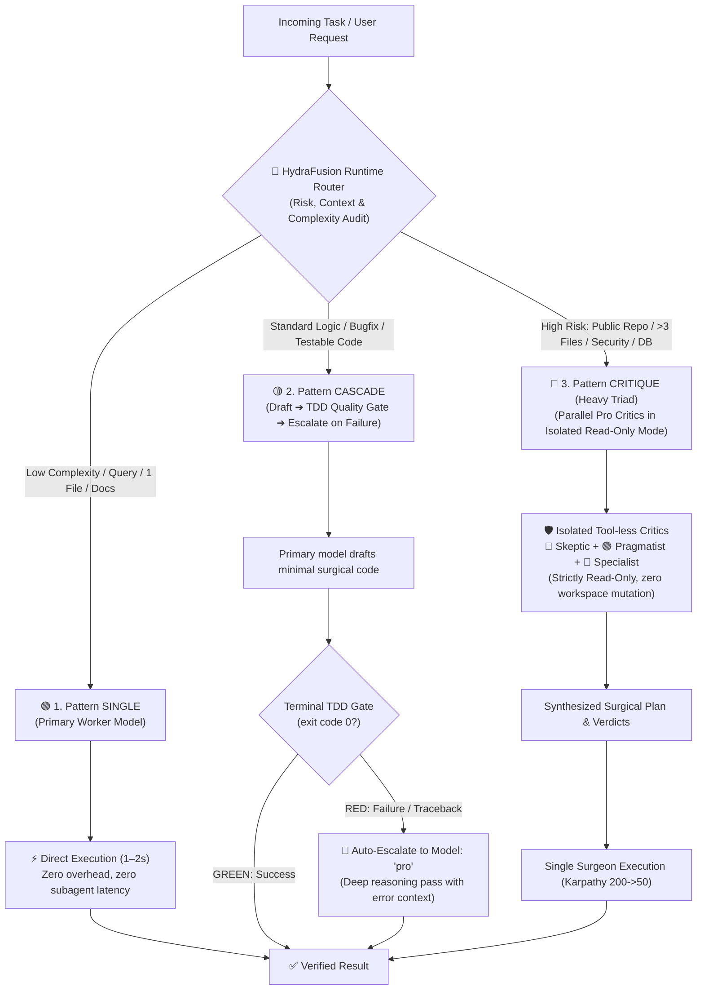

# ⚡ 08. HydraFusion Adaptive Multi-Model Orchestration (v2.6)

> **Inspired by GitHub Copilot Project HydraFusion (Sept 2026):** Moving from static model selection to dynamic runtime workflow orchestration.

---

## 🎯 Core Philosophy

Instead of executing every task through a monolithic static model or forcing a heavy 3-agent council for trivial queries, the **HydraFusion Orchestrator** treats agent execution as a runtime optimization problem balancing three key vectors:

$$\text{Optimization Goal} = \max(\text{Quality}) \times \min(\text{Cost/Tokens}) \times \min(\text{Latency})$$

---

## 🧭 The 3 Execution Patterns

### 🟢 1. Pattern: SINGLE (Direct Execution)
* **Trigger:**
  - Informational questions, everyday advice, documentation lookup.
  - Inspecting files, reading logs, directory listings.
  - Trivial, localized single-function fixes with known patterns.
* **Mechanism:** The primary active agent executes directly in the current context. No subagents spawned, no multi-turn review delay.
* **Latency:** 1–3 seconds.
* **Cost:** Baseline 1x.

---

### 🟡 2. Pattern: CASCADE (Self-Healing TDD Loop)
* **Trigger:**
  - Standard feature implementation, bug fixes, refactoring of a single component.
  - Any task with a deterministic verification command (`pytest`, `npm test`, `dotnet test`, `cargo test`).
* **Mechanism:**
  1. **Draft Phase:** Primary worker generates minimal code satisfying Karpathy principles (200 -> 50).
  2. **TDD Quality Gate:** Execute automated test in the terminal.
     - If `exit code 0` $\rightarrow$ **ACCEPT immediately**. Task complete.
     - If `exit code != 0` $\rightarrow$ **ESCALATE**: Invoke `Model: "pro"` with the exact failure traceback, logs, and failing assertion.
  3. **Pro Healing Pass:** Pro model diagnoses root cause, applies surgical fix, and re-verifies `exit code 0`.
* **Latency:** 3–10 seconds.
* **Cost:** 30–65% cheaper than running Pro upfront on everything.

---

### 🔴 3. Pattern: CRITIQUE (Heavy Triad with Isolated Review)
* **Trigger:**
  - Modifying code in **public repositories** (GitHub, GitLab, npm).
  - Architectural changes spanning **more than 3 files**.
  - Database schema changes, migrations, authentication boundaries, and destructive operations.
* **Mechanism:**
  1. Primary agent drafts implementation plan.
  2. Spawns hardware subagents via `invoke_subagent` with `Model: "pro"`:
     - 🔴 `critic_skeptic` (Charlie Munger Inversion: hunts edge cases, race conditions, unhandled exceptions).
     - 🟢 `critic_pragmatist` (Karpathy Simplifier: cuts bloat, ensures 200->50 lines, removes AI-slop).
     - 🔵 `critic_specialist` (Skill-Hunter: audits against domain `SKILL.md` gold standard).
  3. **Strict Isolated Review:** Critics run in **read-only, tool-less mode**. They NEVER edit files directly.
  4. Critics return structured verdicts: `CONFIRMED` / `PLAUSIBLE` / `DISMISSED`.
  5. Primary agent incorporates feedback into a surgical diff and executes.
* **Latency:** 15–30 seconds.
* **Quality:** Frontier-grade, zero blindspots.

---

## 🛡️ The 5 Operating Principles of HydraFusion

| # | Principle | Implementation in Antigravity |
| :-: | :--- | :--- |
| **1** | **Complete Accounting** | Explicit logging of token usage, execution duration, and tool calls across all legs (draft, test, escalate, critique). |
| **2** | **Bounded Execution** | Every leg has explicit timeouts; infinite retry loops are strictly banned (maximum 1 self-healing attempt before escalation). |
| **3** | **Isolated Review** | Reviewers are strictly read-only inspectors. No concurrent file mutation; only the designated primary surgeon applies diffs. |
| **4** | **Fail-Safe Rollback** | **All-or-Nothing Application:** If validation fails or the workflow is aborted, uncommitted changes are immediately reverted (`git restore .`). No dirty repo state is ever left behind. |
| **5** | **Validated Routing** | Pre-flight check of tools, models, environment, and `SKILL.md` availability before executing mutating commands. |

---

## 📊 Decision Routing Matrix

| Task Characteristics | Files Affected | Verification Method | Selected Pattern | Executing Model |
| :--- | :---: | :--- | :---: | :---: |
| Everyday advice / Q&A / Research | 0 | Inline synthesis | **SINGLE** | Worker (Default) |
| Read file / grep / log audit | 0 | Tool output | **SINGLE** | Worker (Default) |
| Minor bugfix / 1 file tweak | 1 | TDD Test (Exit Code 0) | **CASCADE** | Worker $\rightarrow$ Pro on fail |
| Feature module with existing tests | 1–3 | Unit / Integration tests | **CASCADE** | Worker $\rightarrow$ Pro on fail |
| Multi-file architecture refactor | >3 | Test suite + Triad review | **CRITIQUE** | Heavy Triad (`Model: "pro"`) |
| Public GitHub PR / Open-Source push | Any | Test suite + Triad review | **CRITIQUE** | Heavy Triad (`Model: "pro"`) |
| Auth / Crypto / Security / DB drop | Any | Red-Team security audit | **CRITIQUE** | Heavy Triad (`Model: "pro"`) |
