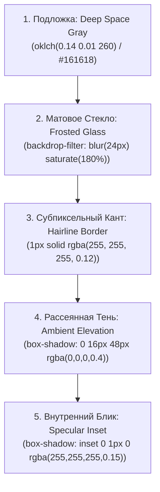

# 🍏 DESIGN_APPLE.md — Мастер-Контракт Apple Cupertino Design System

> **Стандарт Студии Production Hub:** Все визуальные интерфейсы продуктов (веб, десктопные окна Windows, экранные HUD OSD, браузерные плавающие пульты и виджеты) подчиняются единому эстетическому коду **Apple Human Interface Guidelines (macOS Sequoia / iOS 18)**.

---

## 💎 1. Философия Материалов и Глубины (Materials & Elevation)

Никаких «плоских серых прямоугольников» и дефолтного AI-дизайна. Интерфейс должен ощущаться физическим, осязаемым объектом из премиального стекла и матового металла.



### CSS / Web Токены:
```css
:root {
  /* Apple Cupertino Surfaces */
  --apple-bg-base: #000000;
  --apple-surface-card: rgba(26, 26, 30, 0.72);
  --apple-surface-dock: rgba(22, 22, 26, 0.82);
  --apple-surface-hover: rgba(255, 255, 255, 0.08);
  --apple-surface-active: rgba(255, 255, 255, 0.14);
  
  /* Hairline Borders & Highlights */
  --apple-border: rgba(255, 255, 255, 0.12);
  --apple-border-subtle: rgba(255, 255, 255, 0.06);
  --apple-glow-inset: inset 0 1px 0 rgba(255, 255, 255, 0.18);
  
  /* System Accents */
  --apple-accent-blue: #0071e3;
  --apple-accent-green: #30d158;
  --apple-accent-purple: #af52de;
  --apple-accent-orange: #ff9f0a;
  --apple-accent-red: #ff453a;

  /* Typography */
  --apple-text-primary: #f5f5f7;
  --apple-text-secondary: #a1a1a6;
  --apple-text-tertiary: #6e6e73;
  
  /* Radii (Squircle Curvature) */
  --apple-radius-pill: 9999px;
  --apple-radius-xl: 22px;
  --apple-radius-lg: 16px;
  --apple-radius-md: 12px;
}
```

---

## 🔤 2. Типографика Apple Typography (SF Pro)

- **Шрифтовой стек:**
  ```css
  font-family: -apple-system, BlinkMacSystemFont, "SF Pro Display", "SF Pro Text", "Segoe UI", Roboto, Helvetica, Arial, sans-serif;
  ```
- **Заголовки (Display):** Плотный кернинг с отрицательным трекингом `letter-spacing: -0.025em`, четкие насыщенности `font-weight: 600` или `700`.
- **Числа и Таймеры:** Моноширинные цифры (`font-feature-settings: "tnum" 1, "ss01" 1`) — счетчики не прыгают при смене чисел.

---

## 🌊 3. Физика Анимации и Тактильность (Spring Physics & Haptics)

1. **Кривая отклика:** Вместо линейной анимации используется упругая пружинная кривая:
   ```css
   transition: all 0.24s cubic-bezier(0.25, 1, 0.5, 1);
   ```
2. **Тактильный клик (Press Feel):**
   ```css
   .apple-btn:active {
     transform: scale(0.96);
     opacity: 0.88;
   }
   ```
3. **Плавающие капсулы (Dynamic Island / Control Center):**
   - Элементы управления оформляются в виде компактных парящих капсул с эффектом размытия фона и субпиксельной белой обводкой.

---

## 🧩 4. Адаптация Спецификации под Стек Технологий

| Стек Технологий | Тип Интерфейса | Реализация Apple Cupertino Стиля |
| :--- | :--- | :--- |
| **C# .NET / Win32 / WPF** | Десктопные окна и OSD HUD | Плавающий наэкранный HUD в виде Dynamic Island с матовым фоном (`#1c1c1e`), скругленными краями 18px, мягким белым текстом и плавной прозрачностью. |
| **Electron / React / Tailwind** | Кросс-платформенные приложения | Полупрозрачный сайдбар `backdrop-blur-2xl`, палитра Space Black, сквирклы 16px, переключатели в стиле iOS Toggle, живые счетчики с `tnum`. |
| **Python Tkinter / PySide / Qt** | Системные виджеты | Виджет в стиле macOS Sequoia Control Center: безрамочное матовое окно, скругленные кнопки, мягкая шкала отсчета, системные шрифты SF Pro. |
| **Web Apps / Extensions** | Веб-интерфейсы и расширения | Парящий по центру Dynamic Island Dock с эффектом `backdrop-filter: blur(24px)`, сегментированные селекторы и тактильный `:active` отклик. |
| **Terminal CLI (Rich / Colorama)** | Консольные утилиты | Минималистичные тонкие рамки, акцентные пастельные цвета, компактные списки без визуального мусора. |
| **Mobile Web & Responsive** | Мобильные интерфейсы | Кликабельные зоны ≥48px, размер шрифта инпутов ≥16px (защита от нежелательного зума на iOS), безопасные зоны `env(safe-area-inset-bottom)`. |
