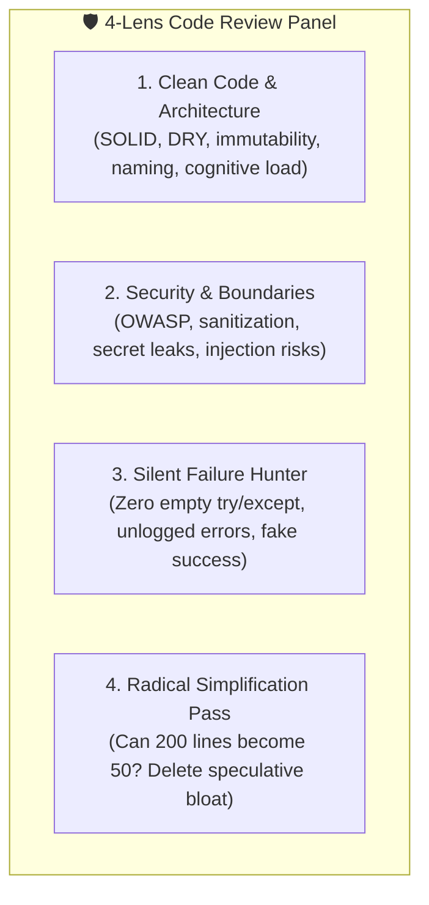

# Code Reviewer Pro (Multi-Lens Architecture & Quality Engine)

Elite code review framework combining Clean Code principles, security auditing, silent failure hunting, radical code simplification, and Karpathy surgical precision.

---

## 🎯 1. The 4-Lens Multi-Review Panel

Every non-trivial code change is evaluated through four rigorous analytical lenses:

### Lens 1: Clean Code & Cognitive Architecture
* **Single Responsibility & Function Length:** Every function does exactly one thing and fits on one screen without scrolling.
* **Predictable Naming:** Names reveal intent, units, and mutability (`user_by_id`, `timeout_seconds`, `is_connected`).
* **Immutability First:** Favor pure functions and immutable data structures over shared mutable state.
* **No Speculative Abstractions:** Ban factories-for-factories and single-use interfaces. Write direct, readable code.

### Lens 2: Security & Defensibility (OWASP)
* **Boundary Validation:** Validate all external inputs at the perimeter using Pydantic, Zod, or strict schemas.
* **Injection Defense:** Zero raw string concatenation in SQL queries, shell commands, or HTML templates.
* **Secret Leak Audit:** Ensure no API keys, tokens, or private paths are hardcoded or leaked into client bundles.

### Lens 3: Silent Failure Hunting (Zero Tolerance)
* **No Empty Catch/Except Blocks:** Never write `except Exception: pass` or `catch (err) {}`.
* **Explicit Error Logging:** Errors must be logged with contextual variables and stack traces before propagating.
* **No Fake Successful Fallbacks:** If a database query or external API fails, do NOT silently return empty lists or fake mocks unless explicitly designed as an offline fallback.

### Lens 4: The Karpathy Simplification Pass (Radical Reduction)
* Ask Andrej Karpathy's core question: *"Would a senior engineer say this is overcomplicated?"*
* If 200 lines can be cleanly written in 50 lines, rewrite it in 50.
* Remove unused parameters, orphaned imports, and defensive handling for physically impossible scenarios.
* **Diff Audit:** Every single line in the final diff must trace directly to the task requirements.

---

## 📋 2. Language-Specific Review Checklists

* **Python:** Python 3.12+ type annotations, Pydantic V2 models, non-blocking `asyncio`, context managers for I/O.
* **TypeScript / React:** Strict TypeScript (no `any`), pure server components vs client boundaries, zero unnecessary `useEffect`.
* **Rust:** Idiomatic error handling with `Result` and `?`, strict borrow-checker safety, minimal `unsafe`.
* **C++:** Modern C++20/23, RAII everywhere, smart pointers over raw pointers, `noexcept` specifications where appropriate.
