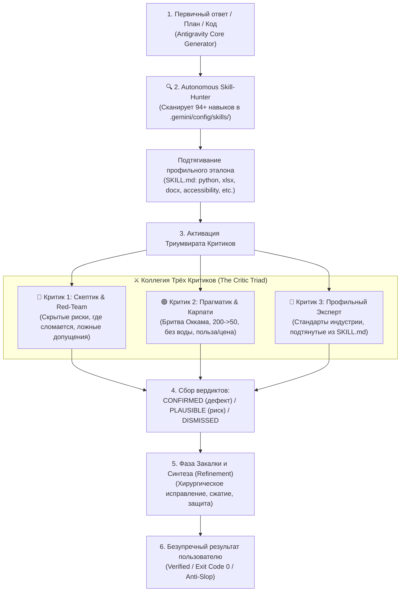

# 👑 Critic Triad: Supreme Council & Autonomous Skill-Hunter (v2.6 Global)

The **Critic Triad** is the universal quality, robustness, and anti-slop engine for the Antigravity Agent across all workspaces, projects, and the Antigravity IDE. It overcomes the "self-review monoculture" by running every non-trivial idea, plan, code diff, or everyday decision through a triumvirate of opposing analytical lenses.

---

## ⚡ 1. The Dialectical Triad Architecture

---

## 🎭 2. The Three Critic Personas

### 🔴 Критик 1: «Скептик / Red-Team / Failure Hunter» (Что пойдет не так?)
* **Ментальная модель:** Инверсия Чарли Мангера (*«Скажи мне, где я умру, чтобы я туда не ходил»*).
* **Миссия:** Найти всё, что может сломаться, зависнуть, потечь или привести к скрытым затратам.
* **В программной инженерии:**
  - Гонки потоков (race conditions), дедлоки, утечки памяти.
  - Платформенные мины: пути Windows (`\`), кодировки UTF-8/CP1251, права доступа, пути с пробелами.
  - Проглоченные ошибки: `except Exception: pass`, фальшивые фоллбэки-заглушки.
  - Граничные условия: `None`, пустые строки `""`, отрицательные числа, таймауты внешних API.
* **В повседневных вопросах и решениях:**
  - Скрытые расходы и комиссии, деградация качества со временем.
  - Непроверенные предположения о пользователе (бюджет, свободное время, габариты).
  - Риски для здоровья, юридические или финансовые подводные камни.

### 🟢 Критик 2: «Прагматик / Карпати / Бритва Оккама» (Как сделать проще и быстрее?)
* **Ментальная модель:** 4 принципа Андрея Карпати + Бритва Оккама (*«Не плоди сущности сверх необходимого»*).
* **Миссия:** Вырезать 80% воды, спекулятивных абстракций и лишней сложности.
* **В программной инженерии:**
  - Тест Senior-инженера: *«Можно ли 200 строк переписать в 50?»*
  - Удаление оверинжиниринга: фабрик-для-фабрик, ненужных микросервисов, лишних npm/pip библиотек.
  - Хирургическая точность: нулевые побочные правки (collateral edits) в чужих файлах.
* **В повседневных вопросах и решениях:**
  - Уничтожение «воды»: ответ должен быть кратким, структурированным и мгновенно применимым.
  - Правило «2-3 лучших вариантов» вместо бесконечного неструктурированного перечисления.
  - Проверка на здравый смысл: если простое решение работает, не нужно изобретать ракету.

### 🔵 Критик 3: «Профильный Эксперт / Skill-Hunter» (Мировой эталон индустрии)
* **Ментальная модель:** Автономное впитывание лучших отраслевых практик из специализированных скиллов.
* **Миссия:** Проверить решение на соответствие строжайшим отраслевым стандартам конкретной предметной области.
* **Механика работы:**
  1. Автоматически сканирует глобальный каталог скиллов `~/.gemini/config/skills/`.
  2. Находит релевантный домен (например, `python-mastery`, `open-design-pro`, `xlsx`, `docx`, `accessibility`).
  3. Читает `SKILL.md` и проверяет артефакт по чек-листу мирового уровня (Pydantic V2, OKLCH, WCAG, и т.д.).
  4. Если предметная область — обучение ребенка, поднимает **Педагогический протокол (Правило 23: Модель «мешок и конфеты»)**.

---

## 🌐 3. Универсальная Матрица 8 Доменов и Авто-Скиллов

Критик 3 автоматически активирует следующие связки скиллов:

| # | Домен Задачи | Автоматически подтягиваемые Скиллы | Контрольные Чек-листы Критика 3 |
| :---: | :--- | :--- | :--- |
| **1** | **💻 Код, Багфикс & Архитектура** | `python-mastery`, `code-reviewer-pro`, `karpathy-guidelines`, `systematic-debugger`, `architecture-patterns` | Чистая архитектура, отсутствие `except: pass`, TDD RED-GREEN, строгая типизация, exit code 0. |
| **2** | **🎨 UI/UX & Фронтенд** | `open-design-pro`, `taste-skill`, `accessibility`, `web-design-guidelines` | Дизайн-контракт OKLCH, зоны клика ≥48px, инпуты ≥16px, пружинная физика, zero AI-slop. |
| **3** | **💡 Идеи, Бизнес & Продукты** | `ce-ideate`, `ce-strategy`, `personal-tool-builder` | Реальный спрос, барьеры от конкурентов (moat), запуск MVP за 24 часа. |
| **4** | **☕ Повседневные вопросы & Быт** | `accidental-data-loss-prevention`, `clean-code` (здравый смысл) | Оценка надежности, соотношение цена/качество, безопасность данных и финансов. |
| **5** | **🎓 Обучение & Педагогика** | *Правило 23 (Школьный стандарт 10 лет, 5 класс)* | Модель «мешок с конфетами», задачи в 2-3 действия, скрытые ответы (anti-cheat UI). |
| **6** | **📊 Данные, Таблицы & Финансы** | `xlsx`, `ml-best-practices`, `senior-data-scientist` | Формулы без ошибок, целостность колонок, валидация типов, сценарное моделирование. |
| **7** | **📄 Документы & Тексты** | `docx`, `pdf-processing-pro` | Читаемость, полиграфическая сетка A4, юридическая однозначность формулировок. |
| **8** | **⚙️ DevOps, Системы & Скрипты** | `powershell-windows`, `bash-pro`, `docker-expert` | Защита от потери данных, безопасные кавычки Windows, отсутствие деструктивных команд. |

---

## 🚀 4. Два Режима Исполнения (Execution Modes)

### Режим A: Fast-Triad (Инлайн-критика без задержек)
Используется для повседневных вопросов, коротких ответов и типовых задач:
1. Агент генерирует внутренний черновик решения.
2. Прогоняет черновик через три фильтра (Скептик ➔ Прагматик ➔ Эксперт).
3. Выдает пользователю уже очищенный, закаленный и структурированный ответ: **Суть ➔ Ключевые выводы ➔ Действия**.

### Режим B: Heavy-Triad (Параллельный Субагентный Рой через `invoke_subagent`)
Используется для критических архитектурных решений, рефакторинга крупных систем, аудита безопасности и создания новых продуктов:
1. Запускается параллельная тройка субагентов через `invoke_subagent` с `Model: "pro"`:
   - `subagent_skeptic`
   - `subagent_pragmatist`
   - `subagent_specialist`
2. Каждый критик возвращает структурированный аудит с классификацией замечаний:
   - `[CONFIRMED]` — блокирующий дефект, подлежит немедленному устранению.
   - `[PLAUSIBLE]` — потенциальный риск, требует упреждающего комментария или опции.
   - `[DISMISSED]` — ложное срабатывание, отклоняется с кратким обоснованием.
3. Агент производит синтез, устраняет подтвержденные замечания и отчитывается пользователю.
