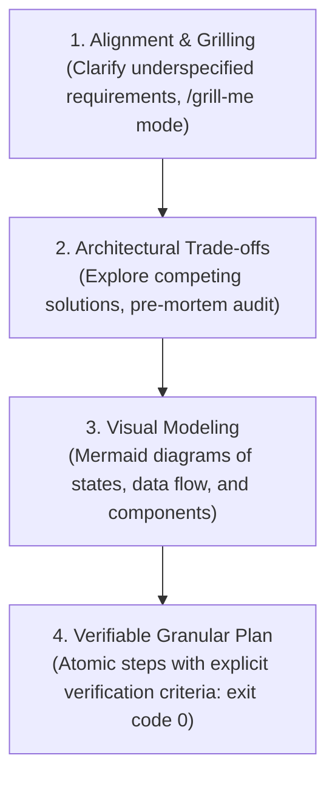

# Execution Planner Pro (Architectural Planning & Alignment Engine)

Rigorous execution planning framework transforming ambiguous ideas into verified, step-by-step implementations with visual architectural modeling and explicit checkpoints.

---

## 🧭 1. The 4-Stage Planning Workflow



### Stage 1: Alignment & The Grilling Interview
* **No Blind Assumptions:** If requirements are ambiguous, stop and interrogate the intent. Never pick a design branch silently.
* **The `/grill-me` Mode:** Proactively ask sharp, clarifying questions regarding user ergonomics, latency budgets, offline support, and edge cases.

### Stage 2: Trade-offs & Pre-Mortem Audit
* **Evaluate Competing Alternatives:**
  - CLI vs Web UI vs Native script
  - In-memory vs SQLite vs Flat files
  - Synchronous vs Event-driven async
* **Pre-Mortem Audit ("What could fail?"):**
  - Identify race conditions, file locks on Windows, token limit burn, or API rate limits *before* touching code.

### Stage 3: Visual Architectural Modeling
* Map out system topology using Mermaid diagrams:
  - **Component Graph:** Dependencies and boundaries between modules.
  - **Sequence Diagram:** Async handoffs, background tasks, and message routing.
  - **State Machine:** Valid state transitions and failure recovery paths.

### Stage 4: Granular Plan with Checkpoints
* Break work down into small, verifiable chunks:
  ```text
  Step 1: [Component A setup] ➔ Verification: [Test/Command with exit code 0]
  Step 2: [Component B logic] ➔ Verification: [Test/Command with exit code 0]
  Step 3: [Integration E2E]   ➔ Verification: [End-to-end run passes]
  ```
* Every step must have an observable, automated pass condition before moving to the next.
