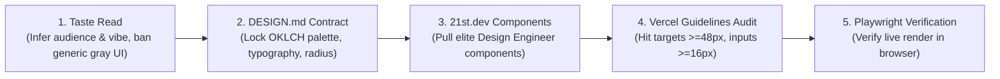

# Open Design Pro (Design Engineer & Anti-Slop Master Engine)

Complete design engineering standard bridging aesthetic taste, strict design contracts (`DESIGN.md`), 21st.dev components, Vercel accessibility guidelines, and tactile micro-interactions.

---

## 🎨 1. The 5-Step Design Pipeline

Every visual deliverable must execute this sequential chain to eliminate generic "AI slop":

### Step 1: Taste Read (Anti-Slop Direction)
* **Audience & Vibe:** Infer the domain atmosphere (e.g. *Linear-like tactical dark mode*, *Stripe-grade financial precision*, *Cyberpunk game HUD*, *Warm editorial craft*).
* **Ban Default AI Aesthetics:** Strictly forbid generic washed-out purple gradients, plain gray boxes, unstyled HTML tables, and lifeless flat forms.

### Step 2: The `DESIGN.md` Contract First
* Every visual deliverable must be bound to `DESIGN.md`:
  * **Color Space:** Perceptually uniform **OKLCH** palette (never raw hex/RGB for interactive states).
  * **Typography Scale:** Harmonic hierarchy with dedicated display and monospace fonts.
  * **Elevation & Borders:** Subtle translucent borders (`border-white/10`), ambient blur, and tactile depth.
  * **Dark Mode Native:** Deep rich obsidian/charcoal surfaces (`oklch(0.12 0.01 260)`), never pure dead `#000000`.

### Step 3: 21st.dev & Component Curation
* Leverage **21st.dev** ("NPM for Design Engineers") and **OpenDesign** patterns.
* Prefer self-contained Tailwind CSS + Framer Motion components with zero vendor lock-in.
* Use Bento Grid layouts, glassmorphism overlays, and kinetic typography for high-impact sections.

### Step 4: Vercel Web Interface Guidelines Compliance
* **Touch & Click Targets:** All buttons and interactive controls must have minimum hit targets of **48x48px**.
* **Mobile Form Inputs:** Form inputs must have font size **>= 16px** to prevent unwanted iOS auto-zoom.
* **Keyboard Focus States:** Clear, high-contrast `focus-visible:ring-2` outline on all interactive elements.
* **Tactile States:** Active and hover states with spring physics (`transform: scale(0.98)` on press).

### Step 5: Absolute Browser Verification
* Verify real render via headless Chromium (Playwright) before reporting ready.
* Check console error logs and ensure zero layout overflow or truncated text.
