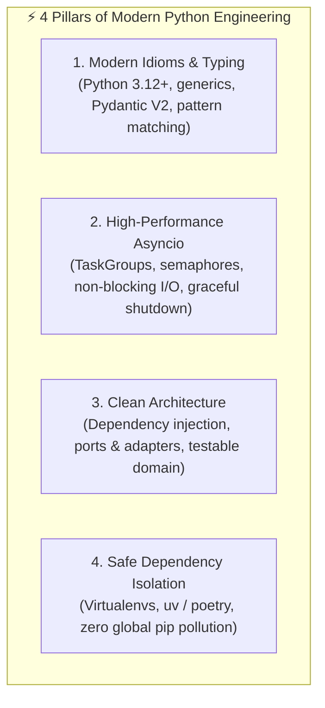

# Python Mastery (Modern Architecture & Async Concurrency Engine)

Comprehensive Python engineering framework emphasizing modern Python 3.12+ features, robust asynchronous patterns, strict typing, and disciplined dependency isolation.

---

## 🐍 1. Modern Python 3.12+ Architectural Pillars

### Pillar 1: Modern Idioms & Strict Typing
* **Modern Syntax:** Utilize new syntax features: `type` statement for type aliases, pipe union operator `X | Y`, structural `match/case`, and self-documenting f-strings `f"{var=}"`.
* **Data Validation with Pydantic V2:** Model all external data, configs, and payloads with Pydantic `BaseModel` or dataclasses with validation.
* **Context Managers Everywhere:** Enforce strict resource cleanup (`with` / `async with`) for files, sockets, database transactions, and temporary processes.

### Pillar 2: High-Performance Concurrency with Asyncio
* **Asyncio TaskGroups:** Prefer Python 3.11+ `asyncio.TaskGroup` over `asyncio.gather` for safe concurrent task supervision and deterministic error propagation.
* **Non-Blocking I/O:** Never run synchronous blocking I/O (like `time.sleep`, synchronous requests, or heavy disk reads) inside async event loops. Offload CPU-bound tasks to `asyncio.to_thread`.
* **Controlled Concurrency:** Use `asyncio.Semaphore` or `asyncio.Queue` worker pools to prevent overwhelming downstream services or exceeding API rate limits.

### Pillar 3: Clean Domain Architecture
* **Separation of Concerns:** Decouple domain logic from presentation (CLI, API, UI) and infrastructure (databases, filesystem, HTTP clients).
* **Dependency Inversion:** Pass interfaces or protocol dependencies into constructors or functions rather than importing global singletons.
* **Fail-Fast Error Handling:** Raise explicit domain exceptions (`EntityNotFoundError`, `ValidationError`) with contextual data rather than generic `ValueError` or `Exception`.

### Pillar 4: Safe Dependency Management
* **Zero Global Pip Installs:** Never run uncontained global `pip install` commands.
* **Isolated Environments:** Always use a project-local virtual environment (`.venv`) managed by fast modern tools like `uv` or `python -m venv`.
* **Reproducible Locks:** Pin dependencies and generate locked manifests (`requirements.txt`, `pyproject.toml`, or `uv.lock`).
