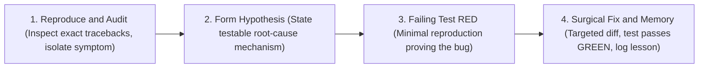

# Systematic Debugger Pro (First-Principles Root Cause Engine)

Comprehensive diagnostic protocol combining first-principles analysis, strict hypothesis-deductive discipline, surgical code fixes, and institutional memory retention.

---

## 🔬 1. The 4-Phase Diagnostic Protocol

Never apply blind changes or random trial-and-error. Always follow the unbroken chain:

### Phase 1: Symptom Isolation & Evidence Audit
* **Inspect Raw Output:** Examine full stack traces, exit codes, and environment variables. Never guess what failed.
* **Trace the Call Stack:** Identify the exact file, function, and line where execution diverged from expectation.
* **Verify System State:** Check permissions, network reachability, file locks, or active processes.

### Phase 2: Hypothesis-Deductive Formulation
* **Formulate a Testable Hypothesis:**
  * Format: *"The error occurs because component [X] receives input [Y] from [Z] under condition [C], which violates assumption [A]."*
* **Counter-Evidence Test:** What observation would definitively prove this hypothesis FALSE? Run that check before editing code.

### Phase 3: Reproducible Isolation (TDD RED)
* Create a minimal, self-contained test or one-off verification script that reliably triggers the failure.
* Confirm that the test **fails for the exact reason hypothesized**, not due to harness setup issues.

### Phase 4: Surgical Fix & Green Verification
* Apply the **Karpathy Surgical Rule**:
  * Modify *only* the specific lines causing the defect.
  * Do NOT refactor adjacent working code, comments, or formatting.
  * Do NOT swallow exceptions with empty `catch` / `except` blocks (Zero Tolerance for Silent Failures).
* Re-run the reproduction test and the entire test suite. Verify clean `exit code 0`.

---

## 🧠 2. Compound Institutional Memory Gate

When the fixed bug involved non-obvious root causes, platform quirks, or subtle race conditions:
1. **Execute Counterfactual Test:** *"If another developer/agent encounters this error 3 months from now, would they lose hours diagnosing it?"*
2. **Auto-Document in `docs/solutions/`:** Record the lesson in `docs/solutions/NNN-<slug>.md` and register it in `docs/solutions/README.md`.
